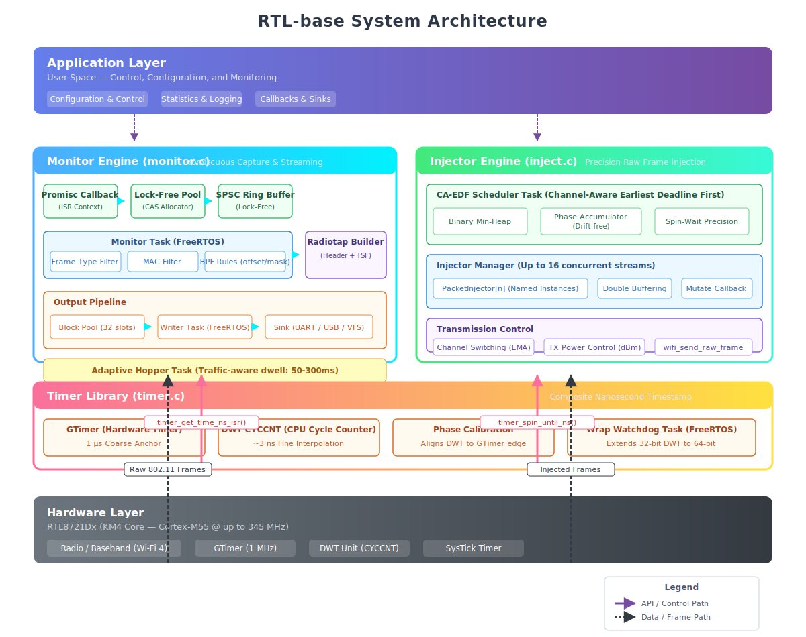
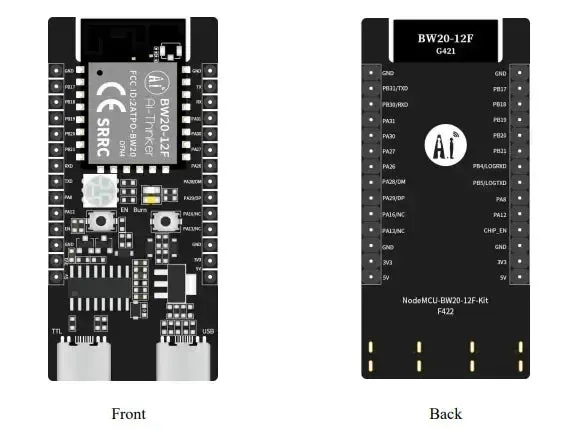

# RTL-base

> **Warning:** This project is currently under active development. Internal APIs and data structures are subject to change.

`RTL-base` is an advanced, real-time C library engineered for the **Ameba RTL8721Dx (KM4/Cortex-M55)** platform. It unlocks deep, low-level access to the Wi-Fi baseband, providing a suite of tools for nanosecond-precision packet injection and a promiscuous-mode monitor engine that streams 802.11 frames over UART.

---

## Table of Contents
- [Overview](#-overview)
- [System Architecture](#-system-architecture)
- [Key Features](#-key-features)
- [Getting Started](#-getting-started)
- [Documentation](#-documentation)
- [License](#-license)

---

## Overview

Built to bridge the gap between low-level hardware registers and high-level network analysis tools, `RTL-base` transforms the RTL8721Dx into a powerful wireless research and diagnostic tool. All modules are thread-safe, SMP-aware, and highly optimized for low-overhead operation on resource-constrained RTOS targets, utilizing lock-free data paths and atomic operations wherever possible.

---

## System Architecture

  

The toolkit is divided into three independent but highly synergistic modules:

1. **High-Precision Timer (`timer.c`)**: Bypasses standard OS ticks to utilize the Cortex-M DWT cycle counter, providing ~3ns resolution timing crucial for RF scheduling.
2. **CA-EDF Packet Injector (`inject.c`)**: A sophisticated scheduler (Channel-Aware Earliest Deadline First) that manages raw 802.11 frame injection with jitter compensation and adaptive backoff.
3. **Monitor Mode Engine (`monitor.c`)**: A non-blocking capture engine that filters, buffers (via SPSC ring buffers), and streams traffic in industry-standard formats directly to a host PC.

---

## Key Features

### High-Precision Timing
* **Nanosecond Resolution**: Precise timestamping with ~3ns resolution (at 200MHz CPU clock).
* **Zero-Division Math**: Optimized integer arithmetic for unit conversions to minimize CPU cycle overhead.
* **Spin-Guards**: Precision busy-waiting for sub-microsecond timing requirements, safe for ISR context.

### Advanced Packet Injection
* **Multi-Injector Support**: Manage up to 16 independent, named injection profiles concurrently.
* **Smart Scheduling**: Minimizes latency and jitter by prioritizing packets based on deadlines and channel-switch costs.
* **Dynamic Reconfiguration**: Update payload, transmission rate, channel, and interval at runtime without halting the scheduler.
* **Robust Retries**: Configurable hardware retry limits with a software retry fallback utilizing exponential backoff.

### Real-Time Monitor Engine
* **Industry Standard Output**: Stream data out-of-the-box in `pcapng` (default) or `libpcap` formats (with Radiotap headers).
* **Advanced Hardware Filtering**: 
    * **MAC Filtering**: Hardware-accelerated Allowlist/Denylist for DA, SA, or BSSID.
    * **Frame Filtering**: Isolate by type (Data, Management, Control) or specific subtypes (Beacons, Probes).
    * **RSSI Gating**: Silently drop frames below a specific dBm threshold to focus on immediate proximity.
* **Adaptive Hopping**: Automatic channel hopping with dwell times that dynamically scale based on current traffic density.

---

## Getting Started

### Prerequisites

  

* **Hardware**: Realtek Amebadplus RTL8721Dx or RTL8711Dx Development Board.
* **SDK**: [Ameba RTOS SDK](https://github.com/Ameba-AIoT/ameba-rtos) (Standard FreeRTOS environment).
* **Host Tooling**: A Linux environment with `wireshark` and standard serial utilities.

### Integration
Clone this repository into your Ameba SDK project workspace and ensure the `inc` paths are added to your CMake/Makefile configuration.

---

## Documentation

For deep-dive API references, internal logic diagrams, and compile-time configuration options, refer to the module documentation:

| Module | Purpose | API Reference |
| :--- | :--- | :--- |
| **Timer** | Cycle-accurate hardware timing | [Timer.md](./docs/Timer.md) |
| **Injector** | Scheduled raw frame transmission | [Inject.md](./docs/Inject.md) |
| **Monitor** | Promiscuous capture and streaming | [Monitor.md](./docs/Monitor.md) |

---

## License

This project is licensed under the **GNU General Public License v2.0 (GPLv2)**. See the [LICENSE](LICENSE) file for full details.
